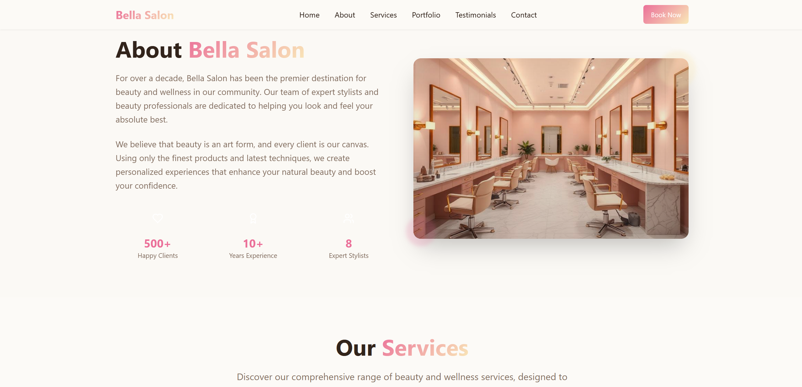

# 💇‍♀️ Beauty Salon Portfolio Website

A modern, responsive **business portfolio landing page** for a Beauty Salon, built with:  
- ⚡ [Vite](https://vitejs.dev/)  
- ⚛️ [React](https://react.dev/) (with TypeScript)  
- 🎨 [Tailwind CSS](https://tailwindcss.com/)  
- 🧩 [shadcn/ui](https://ui.shadcn.com/)  

## ✨ Features
- Responsive & mobile-friendly design 📱  
- Modern UI components with **shadcn/ui**  
- Styled using **Tailwind CSS**  
- Fast builds & HMR with **Vite**  
- Easy to deploy on multiple platforms 🌍 

## Project info

## How can I edit this code?

There are several ways of editing your application.

**Use your preferred IDE**

Using your own IDE, you can clone this repo and push changes.

The only requirement is having Node.js & npm installed

Follow these steps:

```sh
# Step 1: Clone the repository using the project's Git URL.
git clone <YOUR_GIT_URL>

# Step 2: Navigate to the project directory.
cd <YOUR_PROJECT_NAME>

# Step 3: Install the necessary dependencies.
npm i

# Step 4: Start the development server with auto-reloading and an instant preview.
npm run dev
```

**Edit a file directly in GitHub**

- Navigate to the desired file(s).
- Click the "Edit" button (pencil icon) at the top right of the file view.
- Make your changes and commit the changes.

**Use GitHub Codespaces**

- Navigate to the main page of your repository.
- Click on the "Code" button (green button) near the top right.
- Select the "Codespaces" tab.
- Click on "New codespace" to launch a new Codespace environment.
- Edit files directly within the Codespace and commit and push your changes once you're done.

## What technologies are used for this project?

This project is built with:

- Vite
- TypeScript
- React
- shadcn-ui
- Tailwind CSS

## How can I deploy this project?

Follow the steps below to deploy it on different platforms:

Before deploying, make sure to build:

```sh
npm run build
```

This creates the optimized /dist folder.

**1. Vercel**

- Push repo to GitHub
- Import into Vercel
- Build command: npm run build
- Output directory: dist
- Done ✅

**2. Netlify**

- Connect repo to Netlify
- Build command: npm run build
- Publish directory: dist

**3. Hostinger / cPanel**

- Run npm run build
- Upload /dist contents to public_html
- (Optional) Add _redirects file:
```sh
/*    /index.html   200
```
**4. Cloudflare Pages**

- Connect GitHub repo to Cloudflare Pages
- Build command: npm run build
- Output directory: dist

**5. GitHub Pages**
```sh
npm install gh-pages --save-dev
```
In package.json:
```sh
"homepage": "https://<your-username>.github.io/<repo-name>/",
"scripts": {
  "predeploy": "npm run build",
  "deploy": "gh-pages -d dist"
}
```
Deploy:
```sh
npm run deploy
```

## 📸 Screenshots


---

---


## 👤 Author

Muhammad Junaid Sabir

💼 [Linkedin](https://www.linkedin.com/in/muhammad-junaid-sabir-3b9208211/) 

🐙 [GitHub](https://github.com/m-junad-sabir)

## 📜 License

This project is open source and available under the [MIT LICENCE]()